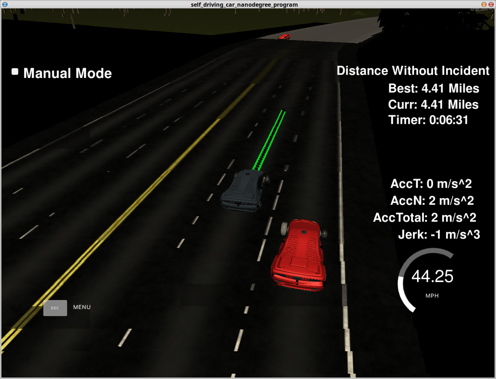
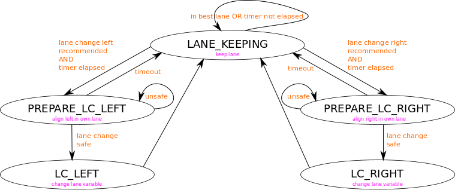

# CarND-Path-Planning-Project
Self-Driving Car Engineer Nanodegree Program

I first go over the project rubric and then explain the code and my approach in detail.

## The code compiles correctly.
The code compiles with cmake and make. I added the files
- spline.h (as seen in the walkthrough)
- prediction.hpp (data structure vehicle, prediction, helpers)
- prediction.cpp (implementation)
- statemachine.hpp (statemachine and timer)
- statemachine.cpp (implementation)
## The car is able to drive at least 4.32 miles without incident..
Can be seen in the screenshot below



## The car drives according to the speed limit.
No incidents. No speeding.
## Max Acceleration and Jerk are not Exceeded.
No incidents. Acceleration and Jerk limits are kept.
## Car does not have collisions.
No incidents in the screnshot. But there are collisions in corner cases.
## The car stays in its lane, except for the time between changing lanes.
No incidents
## The car is able to change lanes
It is (will be described below how and when)
## There is a reflection on how to generate paths.
Please see below

# Reflection
I used the startup code from the walkthrough video to stay in the lane and control the velocity. When there is a possible collision I make use of maximum deceleration and when there is none, I try to go to max speed. You can definitely think of smarter approaches introducing a controller to match speed to the target object. Also only the vehicle in the lane which is set as target lane is regarded. During a lane change maneuver both starting and target lane actually would need to be regarded. Also an anticipation if a vehicle will enter oder leave the lane (cut-in/cut-out detection) would make sense. For the sake of simplicity this was not done.

# Lane Change Recommendation
I start by filling the state vectors of vehicles from the sensor data fusion if they are relevant (before and after the ego vehicle): line 261-275 in main.cpp

Then velocity control by the startup code follows.

I determine the velocity of the neighbor lanes: line 294-323 in main.cpp. Then I choose a policy if any of the neighbor lanes allows faster proceeding than ego lane. Also two lane changes are consideres. Use Case Example: Ego driving on the left lane. Middle lane (ego right lane) is slower but right lane (ego right right lane) is faster. line 326-339 in main.cpp.

# State Machine
My state machine looks like this:



When the above mentioned lane change recommendation fulfills, the statemachine performs a transition to PREPARE_LC_LEFT/RIGHT. Within this state I already start to change the lateral displacement within the own lane in any case to speed lane change up.

If it is then safe to change the lane (finish) line 341-353 in main.cpp and function collisionFree in prediction.cpp, I completely change the lane (by setting the lane variable to the neighbor lane). If the situation is not becoming safe after some time (parameter), I return to LANE_KEEPING and stay there for some time (parameter).

# Some Functions and Classes reviewed

## absSize2D (prediction.hpp and prediction.cpp)
Returns the size of a 2D vector
## determine Lane (prediction.hpp and prediction.cpp)
Returns the lane of ego or other vehicles by given d in Frenet coordinates
## isRelevant (prediction.hpp and prediction.cpp)
Returns if an object is relevant given ego s and target s in Frenet corrdinates
## trajectoryCalc (prediction.hpp and prediction.cpp)
Returns a trajectory given a vehicle state and number of steps in cartesian coordinates
## isCollisionFree (prediction.hpp and prediction.cpp)
Returns if a combination of trajectories is collision free. Incorporates prediction given an ego and a number of target state vectors
## velocityTarAheadinLane (prediction.hpp and prediction.cpp)
Returns velocity of target ahead
## StateMachine Class (statemachine.hpp and statemachine.cpp)
Keeps track of current state and transition to other states.
## Timer (statemachine.hpp and statemachine.cpp)
Keeps track of time (actually it is only a counter and not a timer)


# Trajectory
Since I did not change the trajectory generation compared to the video tutorial, I keep this section short. 

The old trajectory (better to say, what is left of it - not driven over) is always returned by the simulator. So new points to the existing trajectory are added. These points are velocity dependent. Two points from the last trajectory are taken (if not existing take origin point instead) (line 405-433 in main.cpp) and then 3 anchor points are chosen for later spline interpolation (line 438-454 in main.cpp). The anchor points are 30, 60 and 90m away from the starting point. Spline interpolation is done in car coordinate system and rotated to deal with ambiguities. (line 458-466 in main.cpp). Spline generation is done in line 469 and 472 in main.cpp. The path is now filed with the previous path points and the content of the spline, see (line 478-503). Then a transformation back to normal, since a rotation was performed (line 505-516 in main.cpp) and pushed to the trajectory for the simulator.


original README below ...


# CarND-Path-Planning-Project
Self-Driving Car Engineer Nanodegree Program
   
### Simulator.
You can download the Term3 Simulator which contains the Path Planning Project from the [releases tab (https://github.com/udacity/self-driving-car-sim/releases/tag/T3_v1.2).

### Goals
In this project your goal is to safely navigate around a virtual highway with other traffic that is driving +-10 MPH of the 50 MPH speed limit. You will be provided the car's localization and sensor fusion data, there is also a sparse map list of waypoints around the highway. The car should try to go as close as possible to the 50 MPH speed limit, which means passing slower traffic when possible, note that other cars will try to change lanes too. The car should avoid hitting other cars at all cost as well as driving inside of the marked road lanes at all times, unless going from one lane to another. The car should be able to make one complete loop around the 6946m highway. Since the car is trying to go 50 MPH, it should take a little over 5 minutes to complete 1 loop. Also the car should not experience total acceleration over 10 m/s^2 and jerk that is greater than 10 m/s^3.

#### The map of the highway is in data/highway_map.txt
Each waypoint in the list contains  [x,y,s,dx,dy] values. x and y are the waypoint's map coordinate position, the s value is the distance along the road to get to that waypoint in meters, the dx and dy values define the unit normal vector pointing outward of the highway loop.

The highway's waypoints loop around so the frenet s value, distance along the road, goes from 0 to 6945.554.

## Basic Build Instructions

1. Clone this repo.
2. Make a build directory: `mkdir build && cd build`
3. Compile: `cmake .. && make`
4. Run it: `./path_planning`.

Here is the data provided from the Simulator to the C++ Program

#### Main car's localization Data (No Noise)

["x"] The car's x position in map coordinates

["y"] The car's y position in map coordinates

["s"] The car's s position in frenet coordinates

["d"] The car's d position in frenet coordinates

["yaw"] The car's yaw angle in the map

["speed"] The car's speed in MPH

#### Previous path data given to the Planner

//Note: Return the previous list but with processed points removed, can be a nice tool to show how far along
the path has processed since last time. 

["previous_path_x"] The previous list of x points previously given to the simulator

["previous_path_y"] The previous list of y points previously given to the simulator

#### Previous path's end s and d values 

["end_path_s"] The previous list's last point's frenet s value

["end_path_d"] The previous list's last point's frenet d value

#### Sensor Fusion Data, a list of all other car's attributes on the same side of the road. (No Noise)

["sensor_fusion"] A 2d vector of cars and then that car's [car's unique ID, car's x position in map coordinates, car's y position in map coordinates, car's x velocity in m/s, car's y velocity in m/s, car's s position in frenet coordinates, car's d position in frenet coordinates. 

## Details

1. The car uses a perfect controller and will visit every (x,y) point it recieves in the list every .02 seconds. The units for the (x,y) points are in meters and the spacing of the points determines the speed of the car. The vector going from a point to the next point in the list dictates the angle of the car. Acceleration both in the tangential and normal directions is measured along with the jerk, the rate of change of total Acceleration. The (x,y) point paths that the planner recieves should not have a total acceleration that goes over 10 m/s^2, also the jerk should not go over 50 m/s^3. (NOTE: As this is BETA, these requirements might change. Also currently jerk is over a .02 second interval, it would probably be better to average total acceleration over 1 second and measure jerk from that.

2. There will be some latency between the simulator running and the path planner returning a path, with optimized code usually its not very long maybe just 1-3 time steps. During this delay the simulator will continue using points that it was last given, because of this its a good idea to store the last points you have used so you can have a smooth transition. previous_path_x, and previous_path_y can be helpful for this transition since they show the last points given to the simulator controller with the processed points already removed. You would either return a path that extends this previous path or make sure to create a new path that has a smooth transition with this last path.

## Tips

A really helpful resource for doing this project and creating smooth trajectories was using http://kluge.in-chemnitz.de/opensource/spline/, the spline function is in a single hearder file is really easy to use.

---

## Dependencies

* cmake >= 3.5
  * All OSes: [click here for installation instructions](https://cmake.org/install/)
* make >= 4.1
  * Linux: make is installed by default on most Linux distros
  * Mac: [install Xcode command line tools to get make](https://developer.apple.com/xcode/features/)
  * Windows: [Click here for installation instructions](http://gnuwin32.sourceforge.net/packages/make.htm)
* gcc/g++ >= 5.4
  * Linux: gcc / g++ is installed by default on most Linux distros
  * Mac: same deal as make - [install Xcode command line tools]((https://developer.apple.com/xcode/features/)
  * Windows: recommend using [MinGW](http://www.mingw.org/)
* [uWebSockets](https://github.com/uWebSockets/uWebSockets)
  * Run either `install-mac.sh` or `install-ubuntu.sh`.
  * If you install from source, checkout to commit `e94b6e1`, i.e.
    ```
    git clone https://github.com/uWebSockets/uWebSockets 
    cd uWebSockets
    git checkout e94b6e1
    ```

## Editor Settings

We've purposefully kept editor configuration files out of this repo in order to
keep it as simple and environment agnostic as possible. However, we recommend
using the following settings:

* indent using spaces
* set tab width to 2 spaces (keeps the matrices in source code aligned)

## Code Style

Please (do your best to) stick to [Google's C++ style guide](https://google.github.io/styleguide/cppguide.html).

## Project Instructions and Rubric

Note: regardless of the changes you make, your project must be buildable using
cmake and make!


## Call for IDE Profiles Pull Requests

Help your fellow students!

We decided to create Makefiles with cmake to keep this project as platform
agnostic as possible. Similarly, we omitted IDE profiles in order to ensure
that students don't feel pressured to use one IDE or another.

However! I'd love to help people get up and running with their IDEs of choice.
If you've created a profile for an IDE that you think other students would
appreciate, we'd love to have you add the requisite profile files and
instructions to ide_profiles/. For example if you wanted to add a VS Code
profile, you'd add:

* /ide_profiles/vscode/.vscode
* /ide_profiles/vscode/README.md

The README should explain what the profile does, how to take advantage of it,
and how to install it.

Frankly, I've never been involved in a project with multiple IDE profiles
before. I believe the best way to handle this would be to keep them out of the
repo root to avoid clutter. My expectation is that most profiles will include
instructions to copy files to a new location to get picked up by the IDE, but
that's just a guess.

One last note here: regardless of the IDE used, every submitted project must
still be compilable with cmake and make./

## How to write a README
A well written README file can enhance your project and portfolio.  Develop your abilities to create professional README files by completing [this free course](https://www.udacity.com/course/writing-readmes--ud777).

